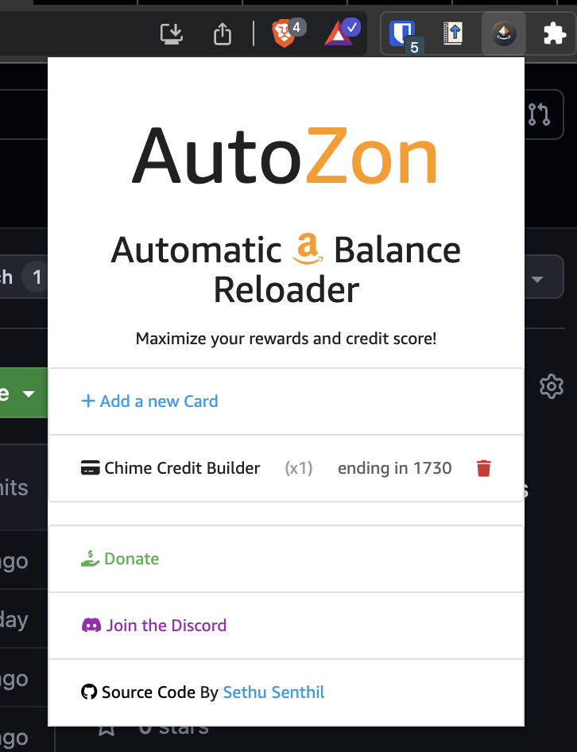

# AutoZon - Browser Extension to automate Amazon Reload Purchases
## Increase Credit Score & Maximize Rewards

<center>  </center>

* WARNING: THIS EXTENSION WILL MAKE PURCHASES ON YOUR BEHALF
* Works on Chrome and other Chromium-based browsers only (Brave, Microsoft Edge) NOT Firefox or Safari (yet)

<center>  </center>

## What is this & Why?
Amazon allows you to reload your account balance (aka purchasing a gift card for yourself) for as low as $0.50.

Many credit cards will close your account for inactivity if you do not use it for a while. When this happens:

- It causes a dip in your credit score, especially if it is your oldest account.
- It leaves a semi-permanent mark on your credit report for up to 10 years.

Some other credit cards, like the Bilt Mastercard, require you to make a minimum number of purchases to unlock the best rewards.

Some banks require a minimum number of purchases to get the best interest rates or avoid fees.

Many people buy small Amazon gift card reloads to meet these requirements easily. Since a lot of people use Amazon anyway, the reloaded balance eventually gets spent.

This browser extension aims to automate this process of making small reloading purchases to make it even easier!

## How to Use?
- Install the extension
- Make sure you are logged into amazon.com
- Make sure you have all the payment methods you want to use in AutoZon already added into Amazon
- Add the credit or debit card into AutuZon (only the last 4 digits is required)
- Run the AutuZon by clicking on the payment method in the AutuZon extension

### Options
- Customize the name of the card (for your viewing in the extension)
- Customize how many times to purchase (some cards require x amount of purchases, so this will come in handy then)
  - Advanced: Customize the delay in between the multiple purchases (stick with the default unless you know what ur doing)
## (Developer) Steps to build and debug the extension

```
npm install

cd example

npm install

cd ../dist/example
```

## TODO
- Make Extension Website
- Organize Project Better

## Credits
- [Puppeteer Extension Transport](https://github.com/project-nous/puppeteer-extension-transport)
- [Materialize](https://github.com/Dogfalo/materialize)